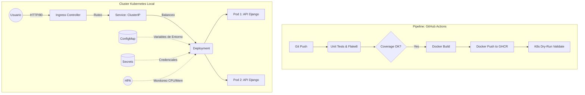
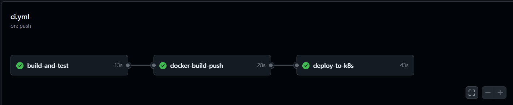
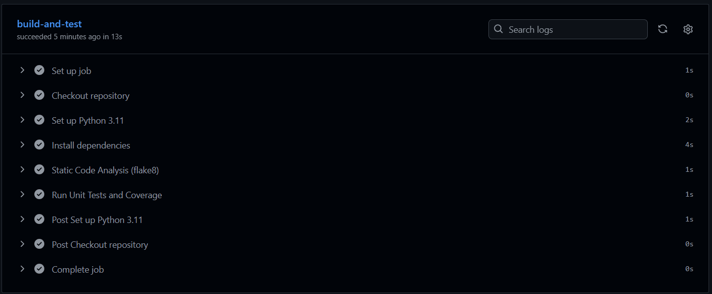

# Devsu DevOps - Prueba Técnica (Python/Django)

Este repositorio contiene la solución a la prueba técnica de DevOps. Se ha dockerizado una aplicación en Python (Django), se ha implementado un pipeline completo de CI/CD utilizando GitHub Actions, y se ha creado la infraestructura en Kubernetes para su despliegue local (Minikube).

## Arquitectura y Diagramas

A continuación se muestra el diagrama de arquitectura tanto para el proceso de despliegue (CI/CD) como para la infraestructura de la aplicación en Kubernetes:



## Instrucciones para Despliegue Local

Para correr este proyecto en tu entorno local, asegúrate de cumplir con los siguientes requisitos:
- Docker y Docker Desktop
- Minikube y `kubectl`

### Opción A: Despliegue rápido con Docker
1. Construye la imagen:
   ```bash
   docker build -t devsu-demo-python:latest .
   ```
2. Ejecuta el contenedor:
   ```bash
   docker run -d -p 8000:8000 devsu-demo-python:latest
   ```
3. Entra a `http://localhost:8000/api/users/` en tu navegador.

### Opción B: Despliegue completo en Kubernetes (Minikube) - Recomendado
1. Arranca tu cluster local y habilita el Ingress:
   ```bash
   minikube start
   minikube addons enable ingress
   ```
2. Construye la imagen dentro del entorno de Minikube:
   ```bash
   minikube image build -t devsu-demo-python:latest .
   ```
3. Despliega la infraestructura (Deployment, ConfigMap, Secret, Service, HPA, Ingress):
   ```bash
   kubectl apply -f k8s/
   ```
4. Accede a la aplicación rápidamente utilizando:
   ```bash
   minikube service devsu-python-service
   ```

*(Nota: Como el despliegue es en un clúster local de Minikube y no en un entorno público, no hay una URL pública, pero se puede validar su funcionamiento con el comando anterior).*

## Resultados del Pipeline (CI/CD)
El pipeline asegura la calidad del código, construyendo la imagen docker optimizada sin usuario root y simulando el despliegue hacia Kubernetes (Dry-Run).

### Flujo Completo


### Análisis de Código Estático (Flake8)
