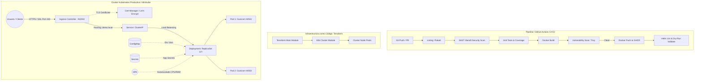

# Devsu DevOps - Prueba Técnica Nivel Producción (Python/Django)

Este repositorio contiene la solución completa a la prueba técnica de DevOps. Se ha optimizado la aplicación en Python (Django) para un entorno de producción real, implementado un pipeline robusto de CI/CD con **controles de calidad y seguridad**, empaquetado el despliegue mediante un **Helm Chart**, estructurado la infraestructura como código con **Terraform** y configurado la capa de red con **Ingress SSL/TLS y DNS**.

---

## 🏗️ Arquitectura de la Solución

El siguiente diagrama detalla la arquitectura completa, desde la integración continua hasta el despliegue en Kubernetes:


```mermaid
graph TD
    %% CI/CD & Security Pipeline
    subgraph Pipeline [Pipeline: GitHub Actions CI/CD]
        A[Git Push / PR] --> B[Linting: Flake8]
        B --> C[SAST: Bandit Security Scan]
        C --> D[Unit Tests & Coverage]
        D --> E[Docker Build]
        E --> F[Vulnerability Scan: Trivy]
        F -->|Clean| G[Docker Push to GHCR]
        G --> H[Helm Lint & Dry-Run Validate]
    end

    %% Infrastructure as Code
    subgraph IaC [Infraestructura como Código: Terraform]
        I[Terraform Main Module] --> J[K8s Cluster Module]
        J --> K[Cluster Node Pools]
    end

    %% Kubernetes Production Cluster
    subgraph Kubernetes [Cluster Kubernetes Productivo / Minikube]
        L((Usuario / Cliente)) -->|HTTPS / SSL Port 443| M[Ingress Controller - NGINX]
        M -.->|TLS Certificate| N[Cert-Manager / Let's Encrypt]
        M -->|Routing: demo.local| O[Service: ClusterIP]
        O -->|Load Balancing| P(Deployment: ReplicaSet x2+)
        
        P --> Q1[Pod 1: Gunicorn WSGI]
        P --> Q2[Pod 2: Gunicorn WSGI]
        
        R[(ConfigMap)] -.->|Env Vars| P
        S[(Secrets)] -.->|App Secrets| P
        T((HPA)) -.->|Autoescalado CPU/RAM| P
    end
```

---

## 🚀 Puntos Clave de Producción y Mejoras Aplicadas

### 1. Servidor WSGI de Producción (Gunicorn)
- Se reemplazó el servidor de desarrollo `manage.py runserver` por **Gunicorn** (`gunicorn demo.wsgi:application --bind 0.0.0.0:8000`), previniendo caídas y asegurando el manejo concurrente de peticiones.
- Las migraciones en el `docker-entrypoint.sh` se ejecutan de forma no interactiva (`migrate --noinput`).

### 2. Empaquetamiento y Parametrización con Helm
- Los manifiestos de Kubernetes se empaquetaron en un Chart de Helm localizado en [helm/devsu-demo-python](file:///c:/Users/USER/Desktop/devsu-demo-devops-python/helm/devsu-demo-python).
- Permite la configuración dinámica de réplicas, límites de recursos, sondas de salud (liveness/readiness), secretos y reglas de Ingress mediante `values.yaml`.

### 3. Calidad y Seguridad en CI/CD
El pipeline en [.github/workflows/ci.yml](file:///c:/Users/USER/Desktop/devsu-demo-devops-python/.github/workflows/ci.yml) incluye:
- **Análisis Estático**: `flake8` para calidad y estándares de código Python.
- **Análisis de Seguridad SAST**: `Bandit` para detectar fallos de seguridad en el código fuente.
- **Pruebas y Cobertura**: `coverage` para validar lógica de negocio.
- **Escaneo de Vulnerabilidades**: `Trivy` para detectar vulnerabilidades críticas en la imagen Docker antes de publicarla.
- **Validación de Helm**: `helm lint` y `helm install --dry-run` para validar el empaquetado de K8s.

### 4. Infraestructura como Código (Terraform)
- En la carpeta [terraform/](file:///c:/Users/USER/Desktop/devsu-demo-devops-python/terraform) se implementó una estructura modular reutilizable (`modules/k8s_cluster`) para el aprovisionamiento automatizado del clúster de Kubernetes y sus pools de nodos.

### 5. Configuración de SSL/TLS y DNS
- El Ingress contempla anotaciones para **cert-manager** y terminación TLS para el hostname configurado (`demo.local`).

---

## 🛠️ Guía de Despliegue

### Opción A: Despliegue Local con Docker
```bash
# 1. Construir la imagen de producción
docker build -t devsu-demo-python:latest .

# 2. Ejecutar el contenedor
docker run -d -p 8000:8000 devsu-demo-python:latest

# 3. Validar estado de la API
curl -i http://localhost:8000/api/users/
```

### Opción B: Despliegue con Helm en Kubernetes (Minikube / Cluster Local)
```bash
# 1. Iniciar Minikube y habilitar Ingress
minikube start
minikube addons enable ingress

# 2. Construir la imagen en el entorno de Minikube
minikube image build -t ghcr.io/jorgemrqz/devsu-demo-devops-python:latest .

# 3. Instalar o actualizar la aplicación vía Helm
helm upgrade --install devsu-demo ./helm/devsu-demo-python

# 4. Probar la aplicación a través del servicio
minikube service devsu-demo-devsu-demo-python
```

### Opción C: Aprovisionamiento de Infraestructura con Terraform
```bash
# 1. Inicializar Terraform
cd terraform
terraform init

# 2. Validar y planificar los cambios
terraform plan

# 3. Aplicar infraestructura
terraform apply -auto-approve
```

---

## 🔍 Verificación de Diagnóstico y Salud
La aplicación incluye probes de Kubernetes para asegurar disponibilidad continuo:
- **Readiness Probe**: Endpoint `GET /api/users/` (Puerto 8000)
- **Liveness Probe**: Endpoint `GET /api/users/` (Puerto 8000)